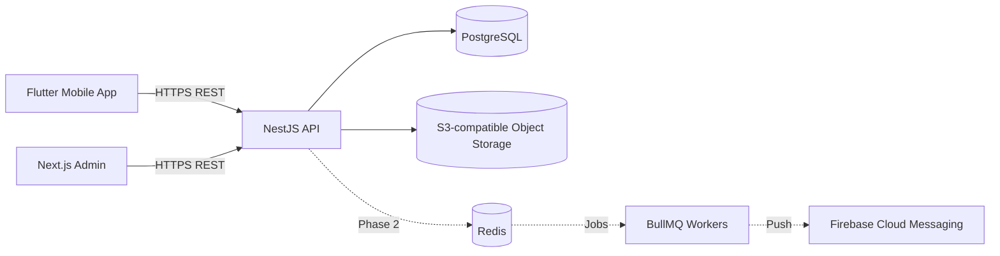
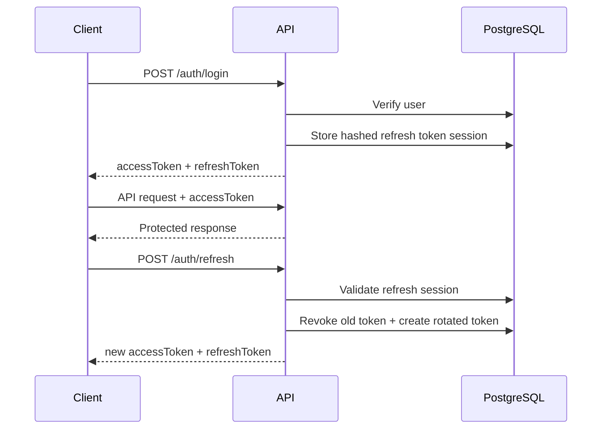
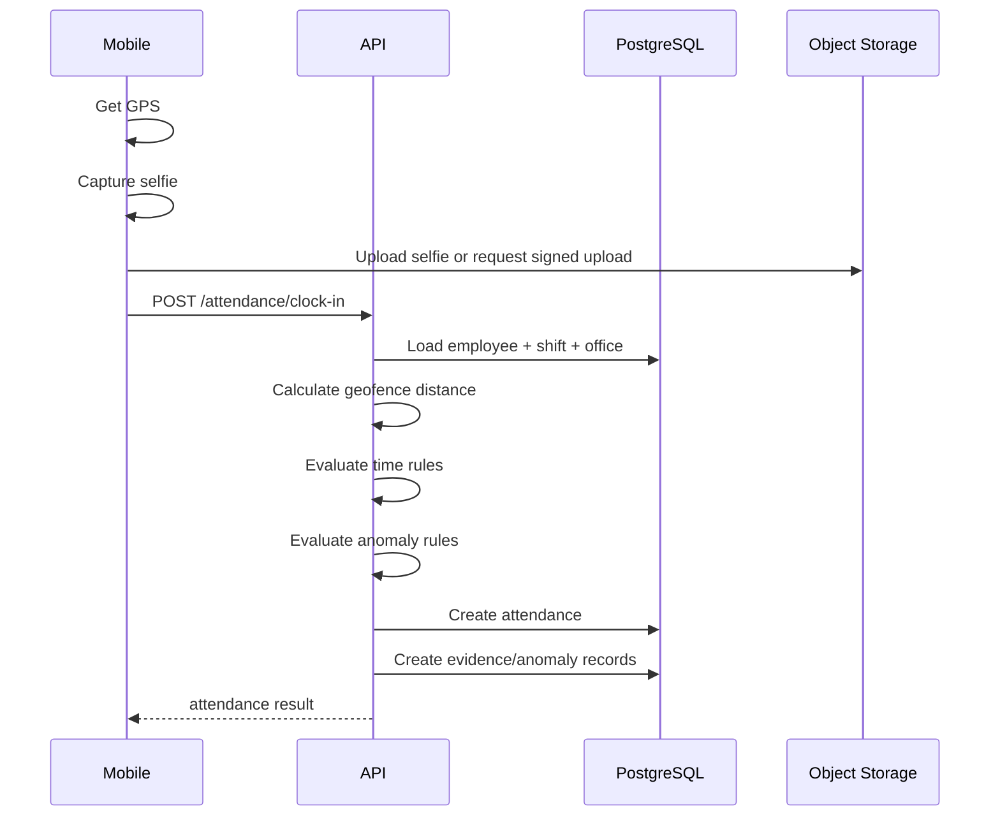

# Kerjancok — System Architecture

## 1. High-Level Architecture



---

# 2. Repository Boundaries

## kerjancok-api

Owns:
- business rules
- authentication
- authorization
- persistence
- payroll computation
- approval engine
- server-side geofence
- auditing
- API contract

## kerjancok-mobile

Owns:
- employee UX
- manager mobile UX
- GPS permission
- camera permission
- selfie capture
- local secure token storage
- API consumption

Must not own:
- final geofence decision
- payroll calculation
- leave balance truth

## kerjancok-admin

Owns:
- HR/admin workflows
- organization management
- employee management
- attendance monitoring
- approval management
- payroll UI
- reports

Must not duplicate backend business rules.

---

# 3. Suggested Backend Modules

```text
src/
├── app.module.ts
├── common/
│   ├── decorators/
│   ├── guards/
│   ├── interceptors/
│   ├── filters/
│   ├── pipes/
│   ├── errors/
│   └── utils/
│
├── database/
│   ├── prisma.module.ts
│   └── prisma.service.ts
│
└── modules/
    ├── auth/
    ├── organizations/
    ├── users/
    ├── employees/
    ├── departments/
    ├── positions/
    ├── offices/
    ├── shifts/
    ├── schedules/
    ├── attendance/
    ├── leave/
    ├── overtime/
    ├── approvals/
    ├── payroll/
    ├── performance/
    ├── recruitment/
    ├── notifications/
    ├── audit/
    └── files/
```

---

# 4. Backend Layering

Recommended pragmatic structure:

```text
Controller
    ↓
Service
    ↓
PrismaService
    ↓
PostgreSQL
```

Do not add repository classes purely for ceremony.

Introduce a repository abstraction only when:

- multiple persistence implementations exist
- query logic becomes significantly complex
- unit-test isolation clearly benefits
- domain logic requires persistence boundaries

---

# 5. Authentication Architecture



Access token:
- short-lived

Refresh token:
- longer-lived
- hashed in database
- bound to session/device where possible

---

# 6. Attendance Architecture



---

# 7. Object Storage

Use for:

- attendance selfies
- employee documents
- sick notes
- candidate resumes
- future payslip PDFs

Store metadata in PostgreSQL.

Do not store raw images in PostgreSQL.

---

# 8. Redis / Queue

Do not require Redis in earliest MVP unless needed.

Add later for:

- notification jobs
- payroll background processing
- report generation
- email delivery
- scheduled reminders
- analytics aggregation

---

# 9. Multi-Tenancy

Tenant boundary:

`organization_id`

Tenant-owned data should consistently include organization ownership directly or indirectly.

Authorization must always verify tenant ownership.

Never trust a resource ID without organization scoping.

---

# 10. Date and Time

Time handling is critical.

Store timestamps in UTC.

Organization has timezone.

Business date calculations use organization timezone.

Examples:

- attendance date
- shift date
- payroll cutoff
- leave start/end day

Do not calculate business dates only from server machine timezone.
