# Kerjancok — Database ERD

> Mermaid ER diagrams are intentionally included in Markdown so AI tools and humans can parse the data model without image OCR.

# 1. Naming Rules

- tables use plural snake_case in PostgreSQL where practical
- Prisma model names may use PascalCase
- IDs should be UUID/CUID consistently
- tenant-owned tables include `organization_id` when practical
- all operational records include `created_at`
- mutable records include `updated_at`

---

# 2. Master Domain Map

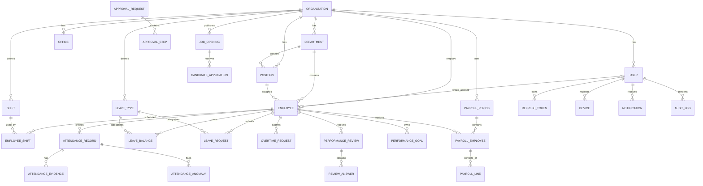

---

# 3. Core HR

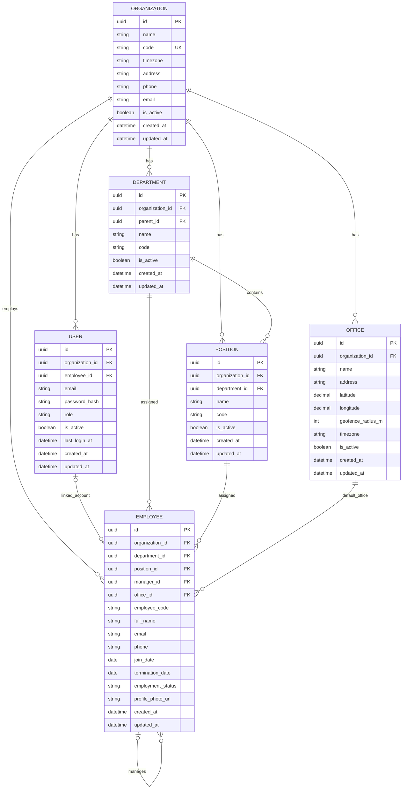

---

# 4. Authentication & Device Sessions

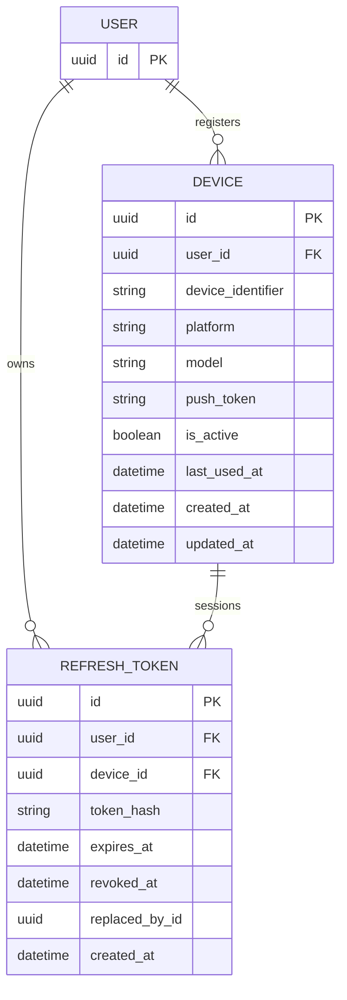

---

# 5. Shift & Scheduling

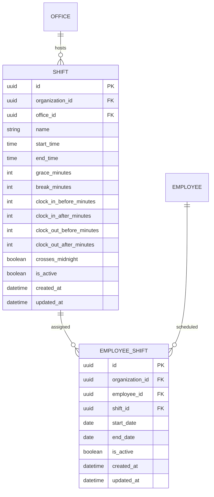

Recommended future extension:

```text
work_schedules
schedule_days
holiday_calendars
holidays
```

Do not add until Phase 1 scheduling limitations require them.

---

# 6. Attendance

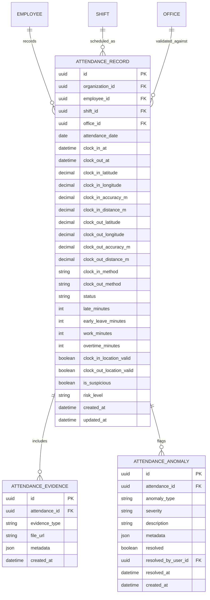

Important unique rule:

```text
UNIQUE(employee_id, attendance_date)
```

This may later need expansion if multiple attendance sessions per day are supported.

---

# 7. Leave

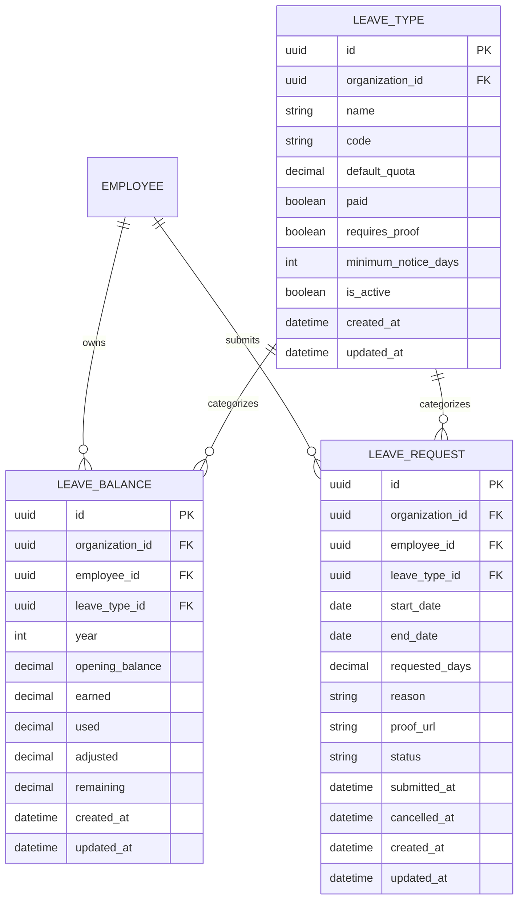

---

# 8. Overtime

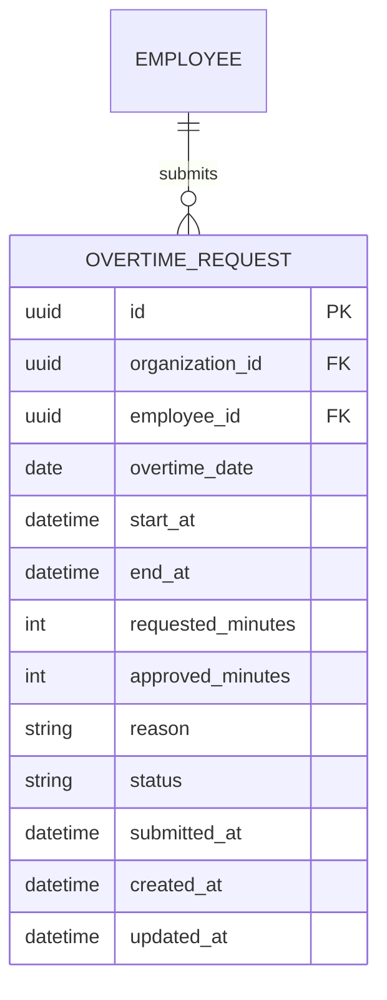

---

# 9. Reusable Approval Engine

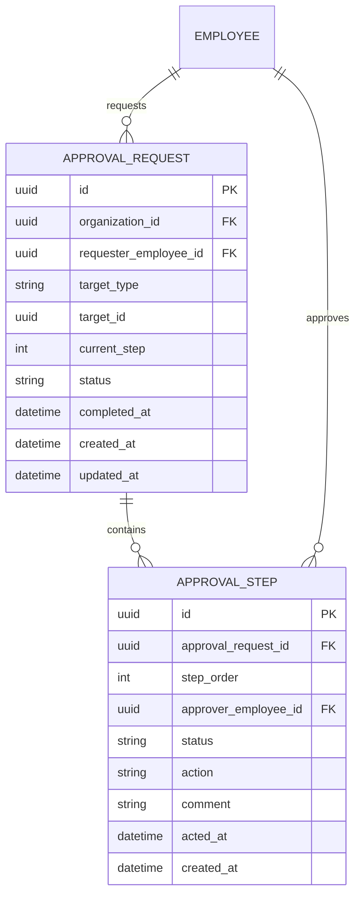

`target_type` examples:

- LEAVE_REQUEST
- OVERTIME_REQUEST
- ATTENDANCE_CORRECTION
- SHIFT_CHANGE

Avoid hardcoding separate approval-table structures per module.

---

# 10. Attendance Correction

Recommended Phase 1 entity:

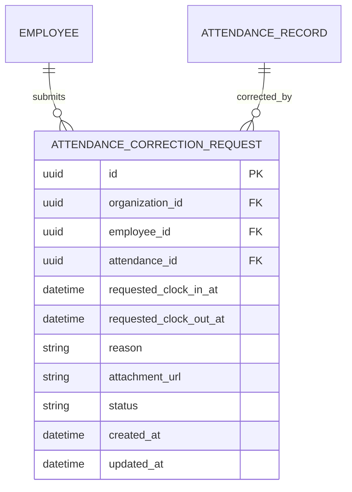

When approved:
- do not overwrite history silently
- update attendance through an audited service
- preserve correction request

---

# 11. Payroll

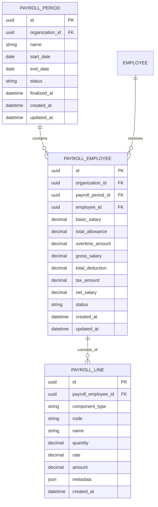

Future configuration tables:

```text
salary_components
employee_salary_components
payroll_rules
tax_profiles
bpjs_profiles
bank_accounts
```

Keep configuration separate from payroll snapshots.

---

# 12. Performance

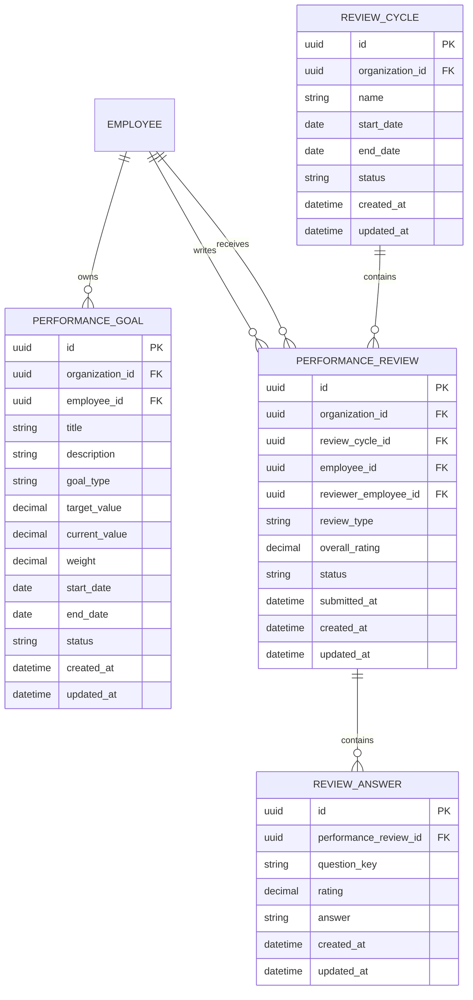

---

# 13. Recruitment

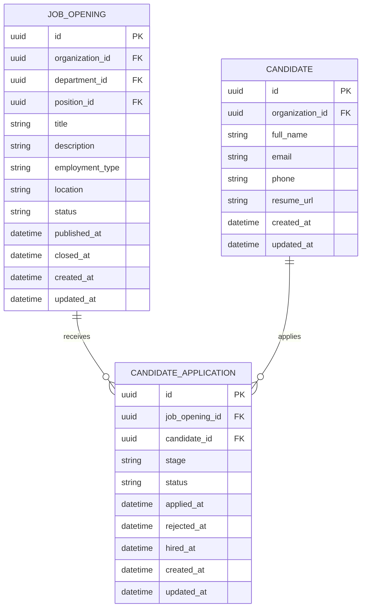

---

# 14. Notifications & Audit

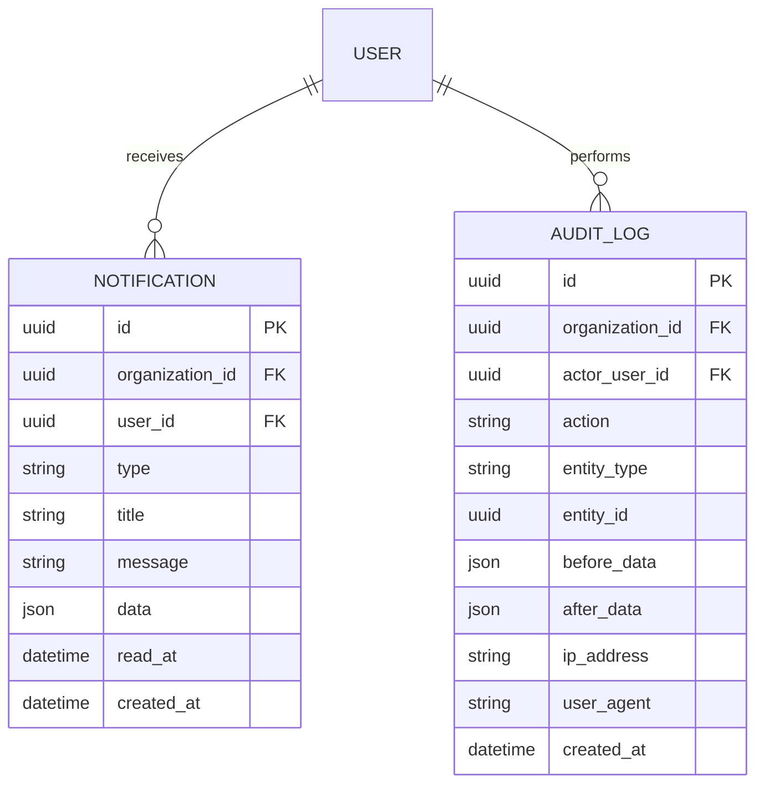

---

# 15. Recommended Core Indexes

## Employee

```text
INDEX(organization_id)
INDEX(organization_id, department_id)
UNIQUE(organization_id, employee_code)
```

## Attendance

```text
UNIQUE(employee_id, attendance_date)
INDEX(organization_id, attendance_date)
INDEX(employee_id, attendance_date DESC)
INDEX(organization_id, status, attendance_date)
```

## Leave

```text
INDEX(employee_id, status)
INDEX(organization_id, start_date, end_date)
UNIQUE(employee_id, leave_type_id, year) -- leave balance
```

## Approval

```text
INDEX(organization_id, status)
INDEX(approver_employee_id, status)
INDEX(target_type, target_id)
```

## Payroll

```text
UNIQUE(payroll_period_id, employee_id)
INDEX(organization_id, status)
```

---

# 16. Important Data Integrity Rules

1. Employee code is unique per organization.
2. User email uniqueness strategy must be explicitly chosen:
   - globally unique, or
   - unique within organization.
3. Attendance cannot belong to another organization's employee.
4. Leave request and leave type must belong to the same organization.
5. Approver must belong to the correct organization.
6. Payroll employee snapshot must belong to payroll period organization.
7. Finalized payroll records should be immutable except through controlled correction workflows.
8. Leave balance mutation must happen transactionally with approval.
9. Refresh token rotation must be transactional.
10. Audit records should be append-only.
